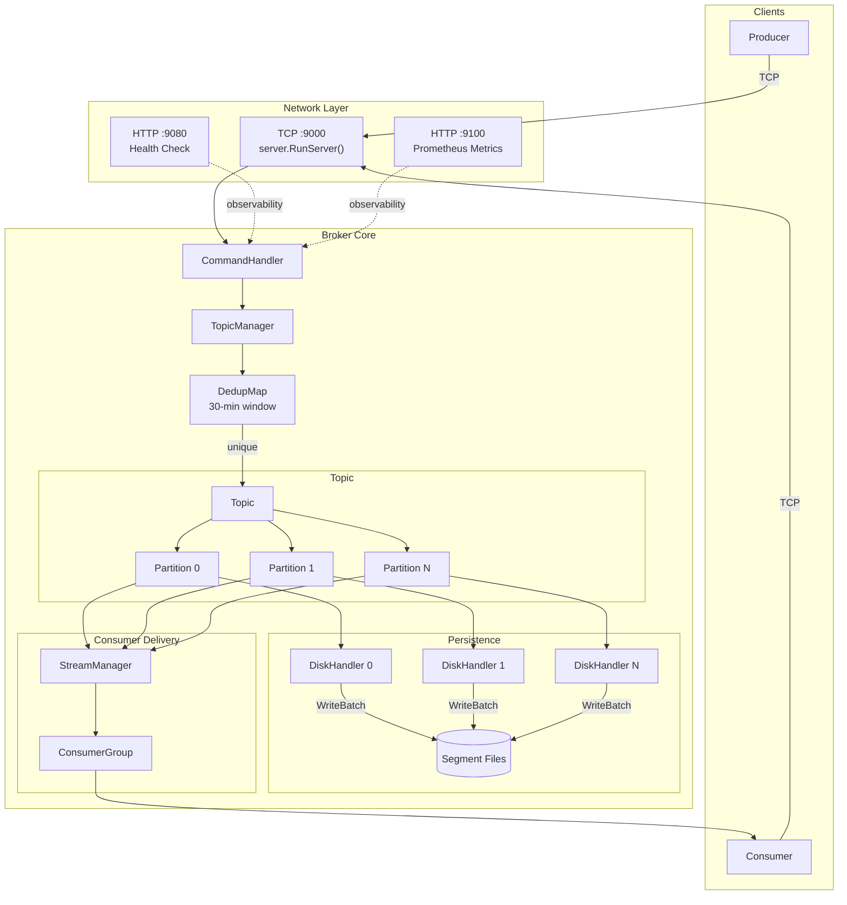
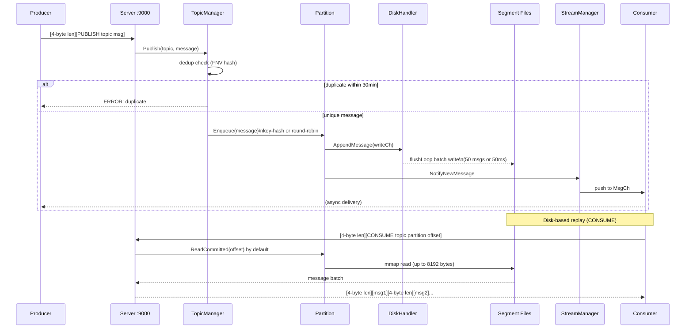
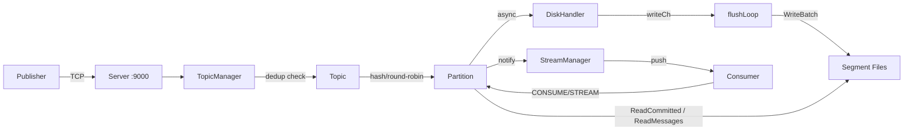
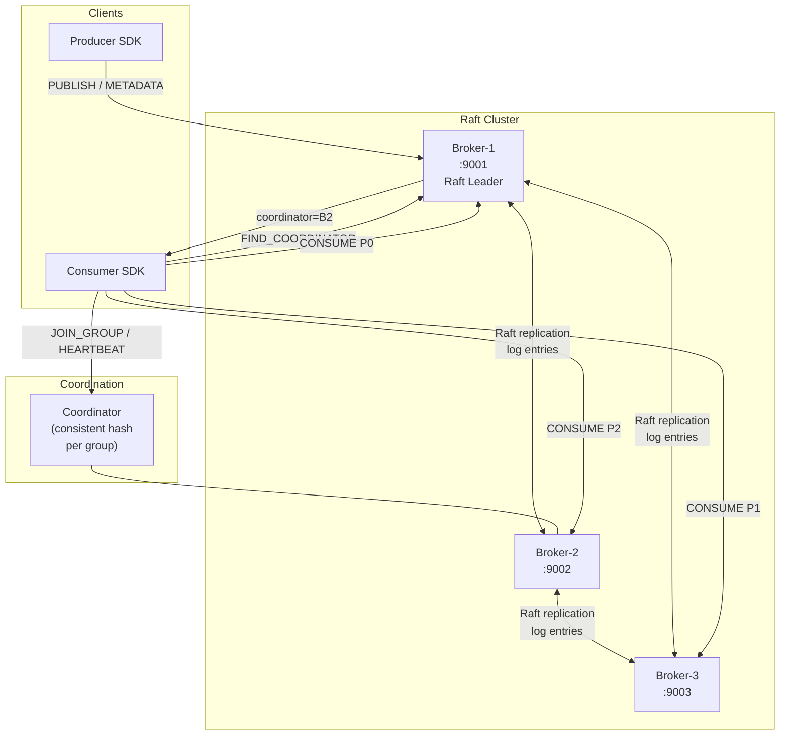
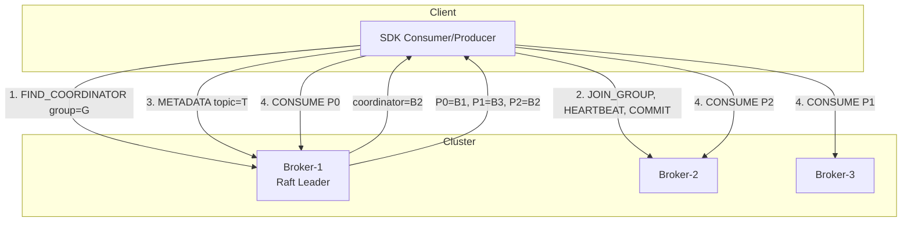
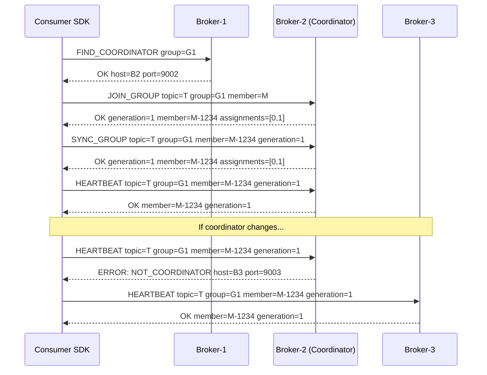
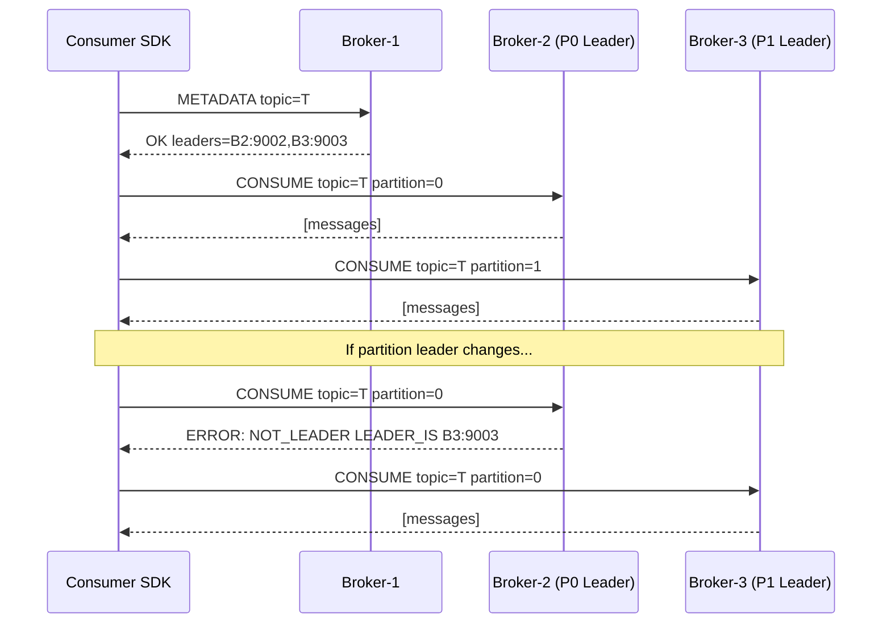
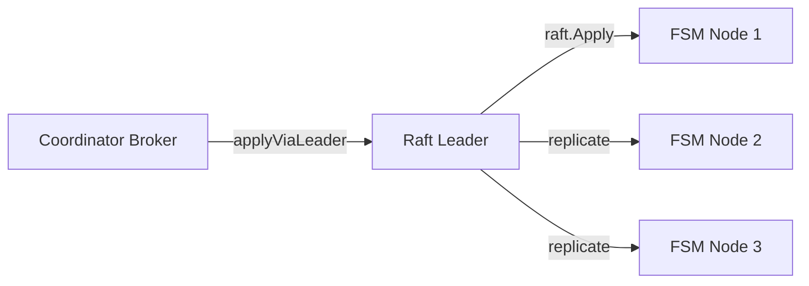

# Architecture Overview

## Purpose and Scope

This document provides a high-level introduction to cursus, a lightweight message broker system.

It covers the system's purpose, core components, and architectural design. For detailed information about specific subsystems, see [Architecture Overview](./contributing/README.md) and [Core Systems](./core/README.md).

For setup instructions, see [Getting Started](./user-guide/README.md).

## System Architecture



## What is cursus?

cursus is a lightweight message broker built around **logically separated but physically distributed data management**.

It provides publish-subscribe messaging with topic partitioning, consumer groups, and durable disk persistence, designed for single-node deployments with minimal operational complexity.

## Key characteristics:

- **Topic-based messaging**: Messages are organized into named topics with configurable partitions
- **Durable persistence**: All messages are persisted to disk using segment-based log files
- **Consumer groups**: Multiple consumer groups can independently consume the same topic
- **Deduplication**: Built-in 30-minute message deduplication window
- **Observable**: Prometheus metrics, health checks, and structured logging


## Network Interfaces

cursus exposes three network ports, each serving a distinct purpose:

| Port | Protocol | Handler | Purpose |
|------|----------|---------|---------|
| 9000 | TCP      | `server.RunServer()` | Main broker operations (`PUBLISH`, `CONSUME`, `CREATE`, etc.) |
| 9080 | HTTP     | `startHealthCheckServer()` | `/live`, `/ready`, and compatible `/health` probes |
| 9100 | HTTP     | `metrics.StartMetricsServer()` | Prometheus exporter with scrape-time broker state |


## Core Data Flow

### End-to-End Data Flow Sequence



### Mermaid Graph Overview



### Key flow characteristics:

- **Deduplication**: `TopicManager.Publish()` checks dedupMap using message ID (hash of payload) to prevent duplicate processing within 30 minutes 
- **Partition Selection**: `Topic.Publish()` uses key-based hashing for ordered delivery or round-robin counter for load balancing
- **Dual-path delivery**: `Partition.Enqueue()` sends to both disk (via DiskHandler) and consumer channels
- **Asynchronous writes**: DiskHandler batches up to 50 messages or flushes after 50ms linger timeout (configurable)
- **Consumer isolation**: Each ConsumerGroup receives messages independently through dedicated channels

## Message Persistence

Messages are persisted using a segment-based append-only log architecture

Each topic-partition pair gets its own DiskHandler instance:

- Writes asynchronously via `flushLoop()` goroutine
- Batches up to 50 messages or flushes after 50ms linger (configurable)
- Rotates segments at 1GB boundaries (configurable via `log_segment_bytes`)
- Uses `mmap`(memory-mapped I/O) for reads
- Stores messages with 4-byte big-endian length prefixes

This architecture enables parallel I/O across partitions and efficient sequential reads. For detailed persistence mechanics, see [Disk Persistence System](./core/storage/disk-persistence.md).

## Cluster Architecture

cursus supports a 3-node Raft-based cluster with coordinator and partition-leader routing.

### Cluster Topology



### Routing Model



### Three Connection Types

| Connection | Target | Discovery | Commands |
|---|---|---|---|
| Any broker | Any node | Config | `FIND_COORDINATOR`, `METADATA`, `CREATE`, `LIST` |
| Coordinator | Per-group (consistent hash) | `FIND_COORDINATOR` | `JOIN_GROUP`, `SYNC_GROUP`, `LEAVE_GROUP`, `HEARTBEAT`, `COMMIT_OFFSET`, `FETCH_OFFSET` |
| Partition leader | Per-partition | `METADATA` | `CONSUME`, `STREAM`, `PUBLISH` |

### Coordinator Pattern



### Partition Leader Routing



### Raft Consensus

Group state changes (JOIN, LEAVE, COMMIT) are persisted via Raft. The coordinator may not be the Raft leader — in that case, `applyViaLeader` forwards the Raft log entry to the leader internally via `RAFT_APPLY`.



### Advertised Addresses

Each broker registers its client-facing address (`ClientAddr`) in the FSM on startup. This allows any broker to resolve any other broker's external address for `METADATA`, `FIND_COORDINATOR`, and `NOT_LEADER` responses.

```yaml
# Docker Compose example
broker-1:
  environment:
    - ADVERTISED_CLIENT_HOST=localhost
    - ADVERTISED_BROKER_PORT=9001
```
