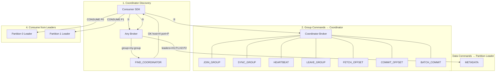
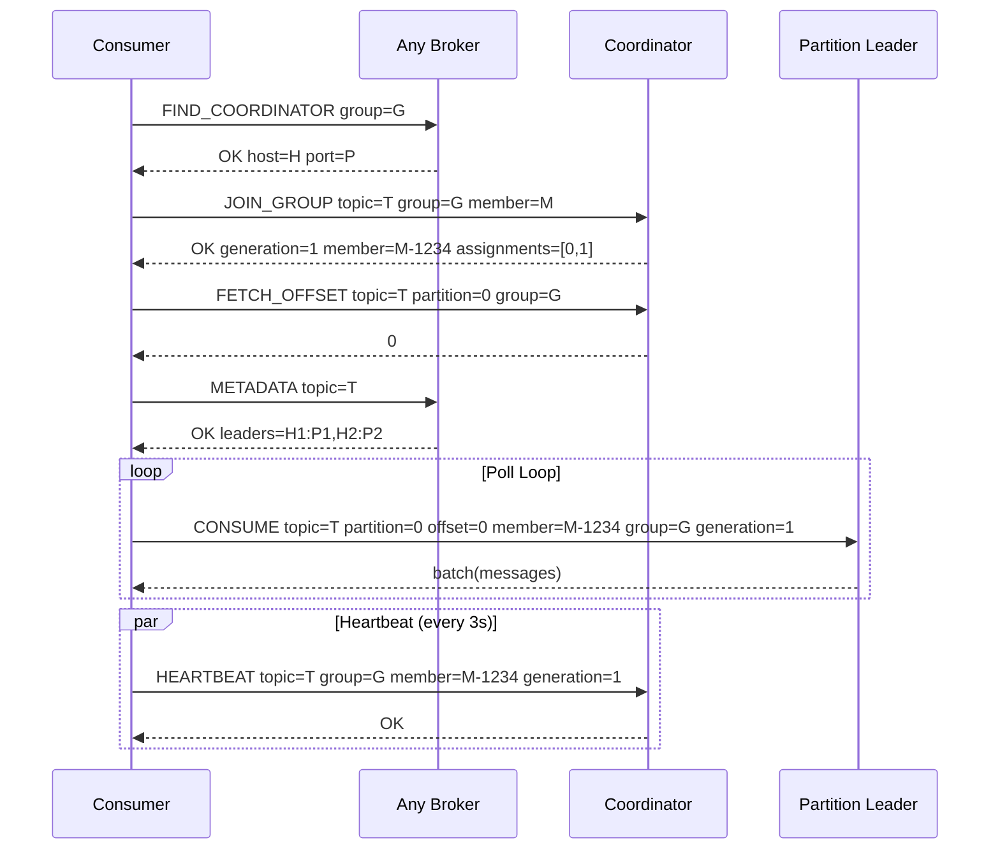
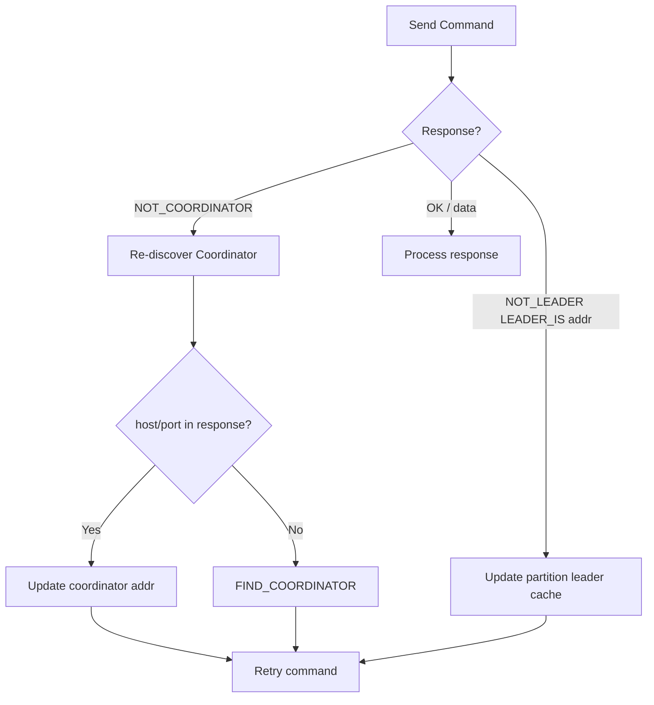

# Cluster Consumer Architecture

Consumer가 클러스터 환경에서 메시지를 소비하기 위한 FindCoordinator 기반 라우팅 아키텍처.

## Overview

Kafka와 동일한 패턴으로, Consumer Group 관련 커맨드는 Coordinator 브로커로, 데이터 커맨드는 파티션 리더로 라우팅합니다.

## Command Routing

## Command Routing Table

| Command | Target | Error Handling |
|---|---|---|
| `FIND_COORDINATOR` | Any broker | Retry with next broker |
| `JOIN_GROUP` | Coordinator | NOT_COORDINATOR → re-discover |
| `SYNC_GROUP` | Coordinator | NOT_COORDINATOR → re-discover |
| `LEAVE_GROUP` | Coordinator | NOT_COORDINATOR → re-discover |
| `HEARTBEAT` | Coordinator | NOT_COORDINATOR → re-discover |
| `FETCH_OFFSET` | Coordinator | NOT_COORDINATOR → re-discover |
| `COMMIT_OFFSET` | Coordinator | NOT_COORDINATOR → re-discover |
| `BATCH_COMMIT` | Coordinator | NOT_COORDINATOR → re-discover |
| `CONSUME` | Partition Leader | NOT_LEADER → update leader cache |
| `STREAM` | Partition Leader | NOT_LEADER → update leader cache |

## Consumer Lifecycle (Cluster)

## Error Recovery

## Implementation Details

### Go SDK

- `findCoordinator()` — sends `FIND_COORDINATOR` via `ConnectWithFailover`
- `getCoordinatorConn()` — connects to coordinator, falls back to `findCoordinator` on failure
- `fetchMetadata()` — sends `METADATA topic=<topic>`, populates `partitionLeaders` map
- `getPartitionLeaderAddr(partitionID)` / `updatePartitionLeader(partitionID, addr)` — thread-safe leader cache
- `ensureConnection()` — prefers partition leader address, falls back to any broker
- `handleBrokerError()` — parses NOT_LEADER, updates partition leader, triggers rebalance on GEN_MISMATCH
- `handleNotCoordinator()` — re-discovers coordinator from response or via FIND_COORDINATOR

### Known Issue: Cluster Consumer Blocking

Go SDK의 Consumer가 클러스터에서 `FETCH_OFFSET` 응답을 기다리면서 블로킹되는 문제가 있습니다.
Python/Java SDK는 매 커맨드마다 새 TCP 연결을 사용하여 이 문제를 회피합니다.
Go SDK는 persistent 연결을 사용하기 때문에, 브로커가 같은 coordinator 주소의 다른 TCP 연결에서 온
FETCH_OFFSET을 처리하지 못하는 것으로 추정됩니다.
