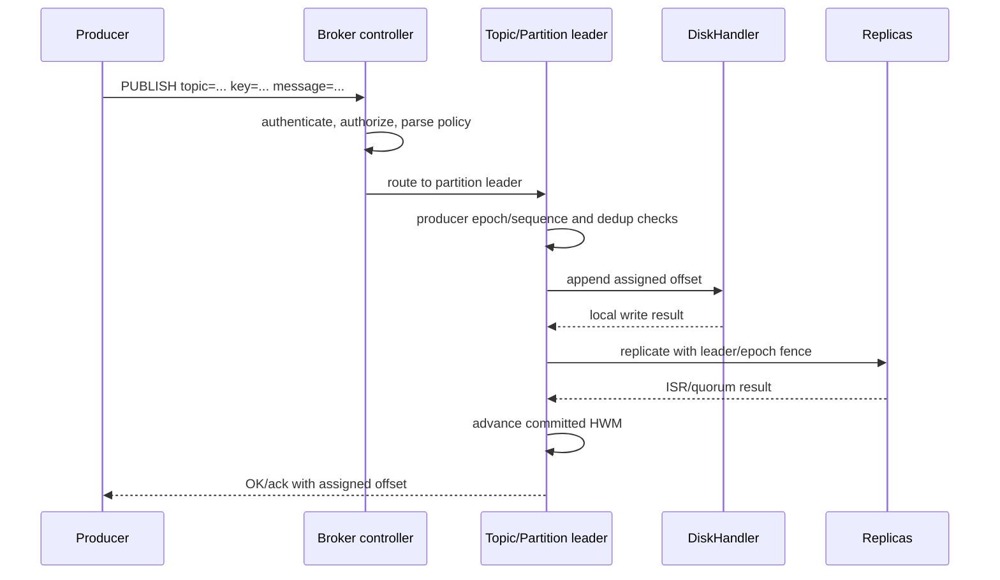
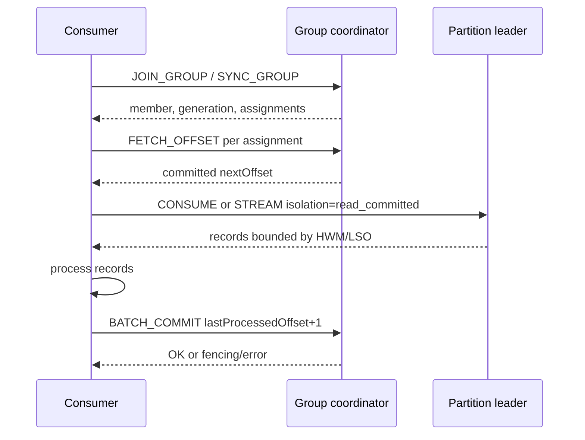
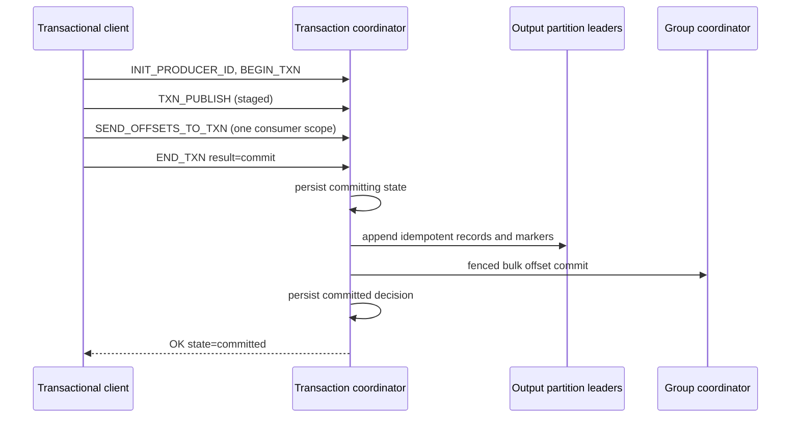

# Message Flow

Cursus has a durable partition-log data path and separate coordinator control paths. The in-process subscription channels are an optimization/API for embedded consumers; network consumers use `CONSUME` or `STREAM` against partition logs.

## Normal Publish

Keyed records use FNV-1a 64-bit hash modulo partition count when the topic policy is `hash_key`; unkeyed records use round-robin. `round_robin` policy ignores keys. Ordering is defined only within one partition.

Acknowledgement strength depends on `acks` and distribution settings. Async enqueue, buffered-writer flush, file sync, replica append, and committed HWM are distinct milestones.

## Consumer Group Read

The broker committed offset is authoritative. A lower request offset does not replay records before an existing commit. A missing offset follows `autoOffsetReset`; an offset removed by retention returns `OFFSET_OUT_OF_RANGE`.

`read_committed` is the default: it returns ordinary records and committed transaction output, skips aborted/control records, and stops at the earliest unresolved transaction. `read_uncommitted` exposes the raw committed partition log.

## Transactional Consume-Process-Produce

Output records remain invisible to `read_committed` until the partition marker and final coordinator decision agree. A restored `committing` transaction is retried. Each completed epoch must be reinitialized before the next transaction; uncertain finalization retry keeps the old epoch.

## Event Sourcing

`APPEND_STREAM` hashes the aggregate key to a partition leader, checks `version = current + 1`, appends/replicates the event, advances committed state, and updates the stream index. `READ_STREAM` and `STREAM_VERSION` are leader-routed and bounded by committed HWM. Snapshots are quorum-replicated optimizations; committed event replay remains authoritative.

## Embedded Fan-out

`TopicManager.RegisterConsumerGroup` creates in-process partition/group/consumer channels using configured capacities. It provides low-latency fan-out inside the broker process, but it is not the dynamic network group coordinator and does not replace durable offset commits, generation fencing, or log replay.

## Failure Handling

- routing failures return `NOT_LEADER` or `NOT_COORDINATOR` with redirect data,
- stale group members/generations and producer epochs are fenced,
- malformed/unauthorized commands fail before mutation,
- partial active-segment tails are truncated during restart recovery,
- HWM is clamped to durable tail,
- stream socket loss without a close-control frame is retryable through the committed offset,
- retention gaps require explicit earliest/latest/error handling.
