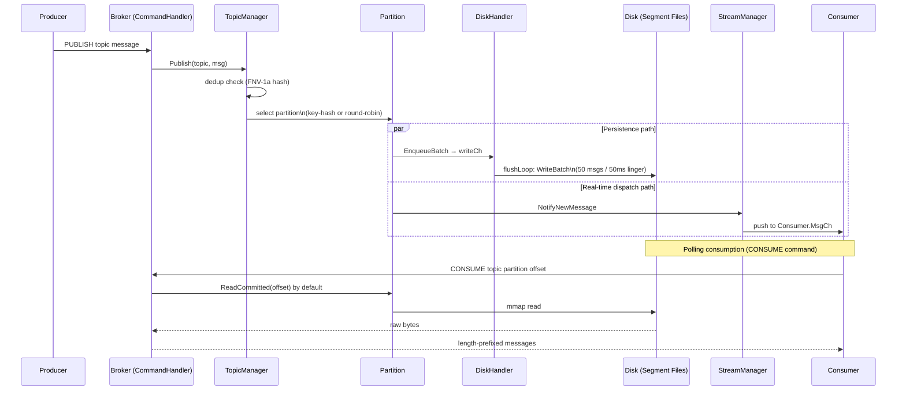
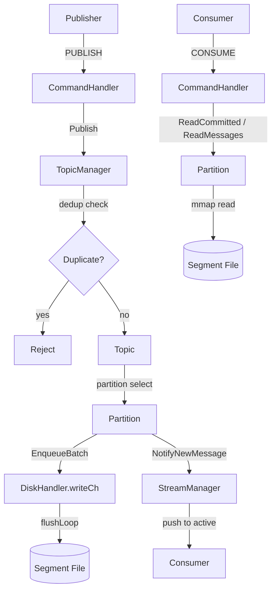

# Message Flow

This document explains how messages flow through Cursus from publication to consumption.

## Message Flow Sequence

## Architecture: Persistent Log with Real-time Fan-out

Cursus is a log-centric message broker designed for high-throughput persistence with low-latency real-time delivery. Unlike brokers that treat memory and disk as separate modes, Cursus employs a unified path where every message is destined for a persistent log, while simultaneously being dispatched to active consumers.

### 1. The Persistence Path (Durability First)
When a message is published, it is immediately handed off to the `DiskHandler` for the target partition. 
- **Asynchronous Batching:** Messages are queued in a `writeCh` and flushed to disk in batches (default 50 messages or 50ms) to maximize I/O efficiency.
- **Segmented Storage:** Data is stored in immutable segment files (default 1GB, configurable), enabling efficient retention and historical replay.

### 2. The Real-time Dispatch Path (Low Latency)
Simultaneously, the message is enqueued into the partition's in-memory channel.
- **Push-based Delivery:** A dedicated `run` goroutine for each partition fans out messages to registered Consumer Groups.
- **Zero-Disk Read for Active Consumers:** Active subscribers receive messages directly from memory, avoiding disk I/O latency for real-time processing.

---

## Detailed Message Journey

### Wire Protocol
All communication uses a TCP-based length-prefixed protocol:
1. **Length Prefix:** 4-byte big-endian `uint32` indicating the payload size.
2. **Payload:** The actual message or command data.

### Deduplication
Cursus implements an optional deduplication mechanism in `TopicManager`:
- A `dedupMap` (sync.Map) tracks message IDs (FNV-1a hash of the payload).
- Duplicate messages within the `CleanupInterval` (default 30 mins) are rejected.

### Partition Selection
Messages are routed to partitions within a topic based on:
- **Key-based Routing:** If a `Key` is provided, `hash(Key) % PartitionCount` ensures ordering for related messages.
- **Round-robin Routing:** If no key is provided, messages are distributed evenly to maximize throughput.

---

## Distribution Mechanism

### In-Memory Fan-out (`SUBSCRIBE`)
Used by Consumer Groups for real-time processing:
1. Partition's `run` loop reads from the internal buffer.
2. Message is forwarded to the `MsgCh` of the assigned consumer in each group.
3. Distribution follows `PartitionID % ConsumerCount` within a group.

### Disk-based Replay (`CONSUME`)
Used for batch processing or catching up:
1. The `CONSUME` command triggers a direct read from disk segments via `DiskHandler`. By default it uses `read_committed`; callers may request `isolation=read_uncommitted` to read the raw committed log, including unresolved transactional records and control markers.
2. Uses **Memory-mapped I/O (mmap)** for efficient random access.
3. Supports offset-based positioning to resume from any point in the log.

---

## Performance Characteristics

| Feature | Mechanism | Benefit |
|---------|-----------|---------|
| **Write Performance** | Asynchronous Batching & `fsync` | High throughput with durability guarantees. |
| **Read Latency** | In-memory bypass for active subs | Sub-millisecond delivery for real-time apps. |
| **Scalability** | Partition-level concurrency | Parallel processing across CPU cores. |
| **Reliability** | Immutable Segmented Logs | Safe recovery and historical auditability. |

---

## Summary of Consumption Patterns

| Pattern | Command | Data Source | Delivery Mode | Use Case |
|---------|---------|-------------|---------------|----------|
| **Real-time Push** | `SUBSCRIBE` | In-memory Buffer | **Streaming** | Stream processing, real-time alerts. |
| **Historical Pull** | `CONSUME` | Disk Segments | **Polling** | Batch jobs, data analysis, specific offset lookup. |
| **Log Streaming** | `CONSUME` | Disk Segments | **Streaming** | Catching up from offset and continuing to listen. |

### Consumption Modes for `CONSUME`

Cursus supports two modes when reading from the persistent log:

1. **Polling Mode (Standard):**
   - The client requests a specific range of messages from an offset.
   - The server reads the available segments, streams the results, and completes the command.
   - Ideal for batch processing or indexing.

2. **Streaming Mode (Follow):**
   - When requested with a "follow" or "tail" intent (implementation via connection persistence), the server continues to stream new messages as they are flushed to disk.
   - This bridges the gap between historical replay and real-time processing.
