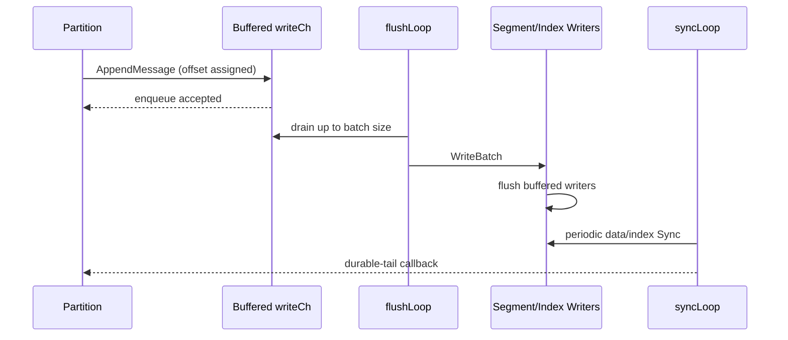

# Disk Persistence

Cursus stores every topic partition in an independent append-only segment log managed by `DiskHandler`. `DiskManager` creates handlers lazily and owns their shutdown lifecycle.

## Components

| Component | Responsibility |
|---|---|
| `DiskManager` | Handler registry keyed by topic/partition, shared configuration, close-all lifecycle, runtime storage metrics. |
| `DiskHandler` | Offset allocation, buffered writes, segment/index files, mmap reads, recovery, sync callback, retention, and standalone compaction. |
| `Partition` | HWM/LSO visibility, producer sequence state, transaction index, and broker-level read semantics. |

The [disk format](disk-format.md) defines the record and sparse index bytes.

## Asynchronous Write Path

Defaults are a 1024-record channel, 50-record batch, 50 ms linger, 10 ms enqueue timeout, and 500 ms file-sync interval. All are configurable. Channel enqueue is backpressure-aware; it is not itself a power-loss durability acknowledgement.

`flushLoop` writes on batch threshold, linger expiry, explicit flush, segment-roll time, or shutdown. `syncLoop` advances the partition durability callback only after data and index sync succeed.

## Direct And Replicated Writes

`AppendMessageSync` allocates an offset and uses `WriteDirect`, which serializes and flushes one record immediately to the file descriptor. `AppendMessageWithOffset` preserves a leader-assigned offset on followers. Both still participate in the partition HWM and replication contract; a buffered writer flush is not the same as a replicated committed decision.

Idempotent/transactional writes validate producer epoch and sequence before append. Producer sequence checkpoints are synced separately and can be rebuilt from durable log records if a checkpoint is lost.

## Segment Rolling

A segment rolls before a write when:

- the configured data byte limit would be exceeded,
- the sparse index file lacks capacity for the next entry,
- `log_segment_roll_ms` expires.

The old data file is flushed and synced, its index is flushed/closed, and the new segment is named with its first logical offset. Default data size is 1 GiB, index size is 10 MiB, and time roll is seven days.

## Read Path

`ReadMessages(offset, max)`:

1. locates the segment containing the logical offset,
2. uses the sparse `.index` file to choose a byte position,
3. mmaps readable segments,
4. validates record lengths and offset order; active segments are contiguous while compacted closed segments may have holes,
5. returns at most `max` decoded retained records.

The raw storage read does not decide transaction visibility. `Partition.ReadCommitted` bounds records by HWM and LSO, hides control/aborted records, and requires matching partition and coordinator transaction decisions. `ReadMessages`/read-uncommitted callers receive raw committed-log content.

## High Watermark And Durability

The partition distinguishes:

- **LEO**: next assigned local offset,
- **flushed tail**: records written through the buffered file writer,
- **HWM**: next offset committed by the active replication/durability path,
- **LSO**: earliest offset safe for `read_committed`, considering unresolved transactions.

HWM is persisted through a synced temporary checkpoint and restored with a clamp to the durable log tail. This prevents a local record flushed before a failed replication decision from becoming committed after restart.

## Startup Recovery

Standalone startup first loads the versioned `__topic_metadata.json` manifest and recreates topic definitions/partition handlers before coordinator initialization. Corrupt, duplicate, unknown-version, or semantically invalid metadata fails startup. A missing manifest with persisted topic logs, or a manifest that omits a persisted topic directory, also fails startup rather than silently losing or recreating data; restore the compatible manifest or archive the orphaned storage before retrying. Distributed snapshot version 6 restores the same topic definitions from FSM state before committed HWM reconciliation; older snapshots reconstruct only the metadata those formats retained.

For the active segment, recovery scans length prefixes and serialized records. Invalid lengths, decode failures, non-contiguous offsets, and partial tails stop recovery at the last valid boundary. The file is truncated and synced to that boundary before writes resume.

After storage opens, higher layers rebuild producer sequence, event-stream, and transaction visibility indexes from durable state as needed. The consumer group coordinator restores offsets from the internal offset log. The transaction coordinator restores standalone state from `__transaction_state.journal` or distributed state from Raft metadata; neither coordinator infers its final decision from output record payloads alone.

## Retention And Compaction

The maintenance loop evaluates delete retention and compaction on independent intervals. Per-topic retention and cleanup policy values override broker defaults.

Delete retention removes complete closed segments and changes the earliest readable offset. Stale reads receive `OFFSET_OUT_OF_RANGE` with earliest/latest boundaries.

Standalone compaction atomically rewrites eligible closed log/index files when the removable-byte ratio reaches the configured threshold. A durable size-bound sidecar distinguishes compacted holes from unmarked offset gaps in ordinary closed segments. Backups and restores must keep each compacted log, its matching sidecar, and its index together. Removed keyed records leave logical offset holes; reads continue at the first retained offset. Transaction/control records and the latest producer recovery record are protected. Distributed and event-sourcing topics reject compaction. See [Log Compaction](log-compaction.md).

## Shutdown

`Close` stops the background loops, drains pending channel records, flushes and syncs the data file, closes index resources, and waits for handler goroutines. Broker shutdown should close producers/consumers before storage to avoid new writes racing the drain.

## Tuning

| Goal | Relevant settings | Trade-off |
|---|---|---|
| Higher throughput | larger channel/batch, modest linger, larger segment | More queued memory and potentially wider unsynced window. |
| Lower latency | smaller batch/linger, shorter sync interval | More syscalls and lower aggregate throughput. |
| Faster sparse seek | smaller index interval | Larger index files and more index writes. |
| Shorter recovery | smaller segments/time roll | More files and metadata operations. |
| More frequent compaction | shorter compaction interval or lower dirty ratio | More scans, rewrite I/O, and temporary disk usage. |

Always validate tuning with restart and failure tests, not throughput alone.
