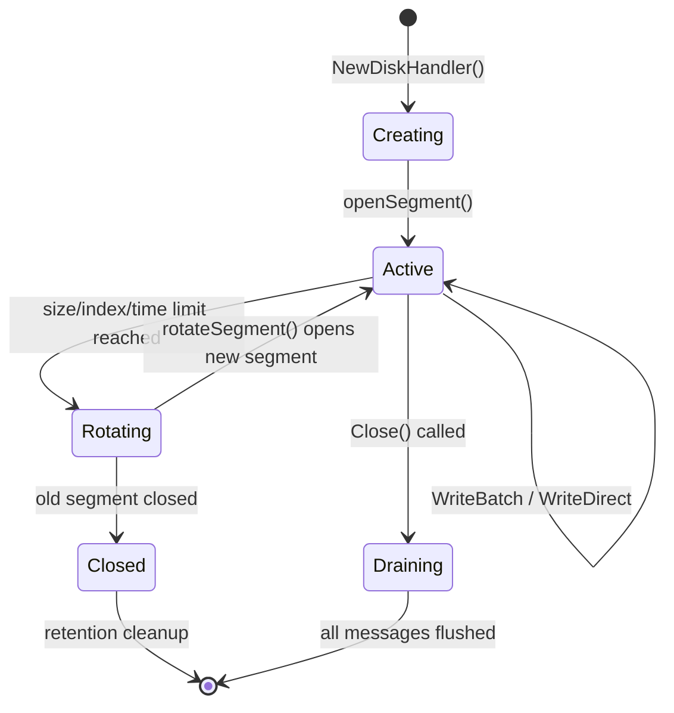

# Segment Management

## Purpose and Scope

This document explains how log segments are created, rotated, and managed in the cursus disk persistence system. 

A segment is a physical file on disk that stores messages for a specific topic-partition pair. Segments are rotated (rolled over to a new file) when they reach the configured size limit (default 1GB), enabling efficient parallel I/O, simplified cleanup operations, and bounded resource usage.

For information about the on-disk message format within segments, see [Disk Format](./disk-format.md). For platform-specific I/O optimizations, see [Platform-Specific Optimizations](./platform-optimizations.md).

## Segment File Structure

### Naming Convention and Directory Layout

Each topic-partition pair has its own directory and sequence of segment files. Segment file names use zero-padded base offsets (20 digits):

```
{LogDir}/{topicName}/
├── partition_{partitionID}_segment_00000000000000000000.log
├── partition_{partitionID}_segment_00000000000000000000.index
├── partition_{partitionID}_segment_00000000000000001024.log
├── partition_{partitionID}_segment_00000000000000001024.index
└── ...
```

The BaseName for a DiskHandler is constructed as: `{LogDir}/{topicName}/partition_{partitionID}`, and individual segment files append `_segment_{offset}.log` (and `.index`) to this base. The offset in the filename is the base offset of the first message in that segment.

### Segment Size Limit

Each segment has a configurable maximum size (default: 1GB = 1,073,741,824 bytes), set via `log_segment_bytes` in the configuration file.

| Parameter | Default | Config Key |
|-----------|---------|------------|
| Segment Size | 1GB | `log_segment_bytes` |
| Index Size | 10MB | `log_index_size_bytes` |
| Index Interval | 4096 bytes | `log_index_interval_bytes` |
| Segment Roll Time | 7 days | `log_segment_roll_ms` |

Rotation is triggered when either the data file or index file would exceed its size limit, or when the time-based roll interval expires.

## Segment Lifecycle



## Segment Creation

### Initial Segment Creation

When a DiskHandler is first created, it initializes with segment 0. The process occurs in `NewDiskHandler()`:

- Constructs the BaseName path from config and topic/partition IDs
- Creates the directory structure if it doesn't exist
- Opens or creates `{BaseName}_segment_0.log` with flags
- Wraps the file in a bufio.Writer for buffered I/O
- Initializes `CurrentSegment = 0` and `CurrentOffset = 0`

## Platform-Specific openSegment()

The `openSegment()` function creates or opens a segment file and is platform-specific. On Windows, it uses standard file operations:


1. Windows implementation
```
flags := os.O_CREATE | os.O_RDWR | os.O_APPEND
f, err := os.OpenFile(
    fmt.Sprintf("%s_segment_%d.log", d.BaseName, d.CurrentSegment),
    flags, 
    0644
)
```

2. On Linux, additional optimizations are applied (see [Platform-Specific Optimizations](./platform-optimizations.md) for details on fadvise and other Linux-specific enhancements).

## Segment Rotation

### Rotation Trigger

Segment rotation occurs in the `writeBatch()` function when writing a message would exceed the SegmentSize:

```
totalLen := 4 + len(data)  // 4-byte length prefix + message data
if d.CurrentOffset+totalLen > d.SegmentSize {
    if err := d.rotateSegment(); err != nil {
        log.Printf("ERROR: rotateSegment failed: %v", err)
        break
    }
}
```

The condition `d.CurrentOffset + totalLen > d.SegmentSize` ensures that each segment never exceeds exactly 1MB. The rotation happens before writing the message that would exceed the limit.

### The `rotateSegment()` Process

The `rotateSegment()` function orchestrates the transition from one segment file to the next:

The rotation process is synchronized with both mu (metadata lock) and ioMu (I/O lock) held by the calling writeBatch() function, ensuring thread safety.

### Rotation Steps:

| Step | Action                      | Error Handling                        |
|------|-----------------------------|--------------------------------------|
| 1    | Flush bufio.Writer           | Error logged, collected              |
| 2    | Close current file           | Error logged, collected              |
| 3    | Increment CurrentSegment     | N/A                                   |
| 4    | Reset CurrentOffset to 0     | N/A                                   |
| 5    | Call `openSegment()`           | Error collected                       |
| 6    | Return aggregated errors     | Multiple errors returned as slice     |


## DiskManager and Handler Registry

### Handler Registry Architecture

The DiskManager maintains a central registry of all DiskHandler instances in the system. 

Each topic-partition pair gets exactly one DiskHandler instance, preventing duplicate file handles and ensuring serialized writes.

### Handler Key Format

Handlers are keyed in the registry using the format: "`{topic}_{partitionID}`". 

This simple string key allows O(1) lookup:

```
key := fmt.Sprintf("%s_%d", topic, partitionID)
if dh, ok := dm.handlers[key]; ok {
    return dh, nil
}
```

### GetHandler() - Lazy Initialization

The `GetHandler()` method implements lazy initialization - handlers are created on first access:

| Step | Action                            | Synchronization       |
|------|----------------------------------|---------------------|
| 1    | Acquire `DiskManager.mu` lock       | sync.Mutex          |
| 2    | Check if handler exists in map    | Map lookup           |
| 3    | If exists, return existing handler| Early return         |
| 4    | If not exists, create log directory| `os.MkdirAll()`       |
| 5    | Create new DiskHandler               | `NewDiskHandler()`   |
| 6    | Store in handlers map             | Map insertion        |
| 7    | Return new handler                | Release lock         |


## Handler Lifecycle Management

The `CloseAllHandlers()` method cleanly shuts down all handlers during broker shutdown:

```
func (dm *DiskManager) CloseAllHandlers() {
    dm.mu.Lock()
    defer dm.mu.Unlock()
    
    for name, dh := range dm.handlers {
        fmt.Printf("Closing DiskHandler for %s\n", name)
        dh.Close()
        delete(dm.handlers, name)
    }
}
```

This ensures:

- All pending writes are flushed via the flushLoop shutdown sequence
- All file handles are closed properly
- No orphaned goroutines remain

## State Descriptions

| State     | Description                       | File Operations                                         | Thread Safety                  |
|-----------|-----------------------------------|---------------------------------------------------------|--------------------------------|
| Creating  | Segment file is being opened       | `os.OpenFile()` with O_CREATE | O_RDWR | O_APPEND         | Protected by ioMu              |
| Active    | Current segment accepting writes   | bufio.Writer.Write(), periodic `Flush()` and `Sync()`      | Protected by both mu and ioMu  |
| Rotating  | Transitioning to next segment     | `Flush()`, `Close()`, increment counters, `openSegment()`    | Protected by both locks         |
| Closed    | Previous segment, no longer written| Read operations via `mmap.Open()`                        | Only metadata protected by mu   |


## Concurrency and Thread Safety

### Dual-Lock Strategy

The DiskHandler uses two separate mutexes to allow concurrent reads and writes:

### Lock Acquisition Patterns:

| Operation        | Locks Acquired           | Purpose                        |
|-----------------|-------------------------|--------------------------------|
| `writeBatch()`     | mu then ioMu            | Update offset and perform I/O  |
| `rotateSegment()`  | mu and ioMu (inherited) | Update metadata and replace file |
| `ReadMessages()`   | mu only                 | Read current segment number     |
| `AppendMessage()`  | None (channel-based)    | Non-blocking enqueue            |


This dual-lock design allows:

- Read operations to check metadata without blocking on I/O
- Write operations to serialize both metadata updates and file operations
- Proper ordering to prevent deadlocks (always mu before ioMu)

## Segment File Operations Summary

### Write Operations

| Operation       | Triggers Segment Action                     | Segment State Change                             |
|-----------------|--------------------------------------------|-------------------------------------------------|
| `writeBatch()`    | Checks if rotation needed before each message | Active → Rotating → Active (new segment)       |
| `rotateSegment()` | Closes current, opens next                  | Active → Closed (old), Creating → Active (new) |
| `WriteDirect()`   | Checks if rotation needed                   | Same as `writeBatch()`                             |
| `flushLoop()`     | Calls `writeBatch()` periodically             | Indirect via `writeBatch()`                        |


### Read Operations

| Operation                 | Segment Access                                | Locking                               |
|---------------------------|-----------------------------------------------|--------------------------------------|
| `ReadMessages()`            | Opens current segment via `mmap.Open()`         | Acquires mu to read CurrentSegment   |
| `SendCurrentSegmentToConn()`| Transfers current segment to network connection | Acquires both locks, uses `io.Copy()` |


## Key Takeaways

- **Configurable Segment Boundary**: Default 1GB, enforced before writing each batch to prevent segments from exceeding size
- **Sequential Naming**: Segments numbered sequentially (0, 1, 2, ...) per topic-partition
- **Atomic Rotation**: `rotateSegment()` ensures clean transition with proper flush and close operations
- **Lazy Creation**: DiskManager creates handlers on-demand via `GetHandler()`
- **Thread Safety**: Dual-lock strategy (mu and ioMu) enables concurrent reads and serialized writes
- **Error Resilience**: Rotation errors are collected and logged but don't crash the system
