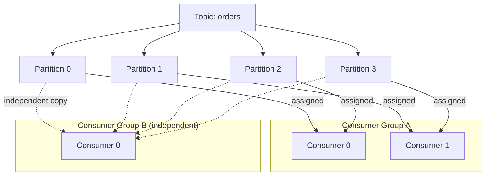
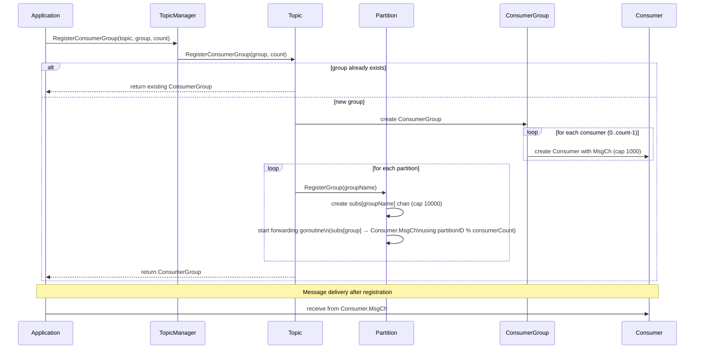
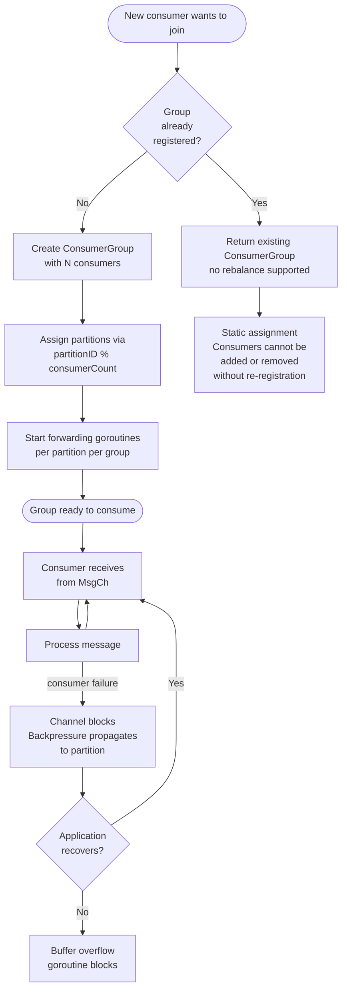

# Consumer Groups

This document explains how consumer groups work in cursus, including their structure, registration process, load balancing mechanism, and message distribution strategy. Consumer groups enable multiple consumers to share the load of processing messages from a topic while maintaining ordering guarantees within partitions.

For information about topic and partition structure, see [Topics and Partitions](./topics-and-partitions.md). For the broader topic management system, see [Topic Management System](./topic-management.md).

## Purpose and Functionality

Consumer groups provide a mechanism for horizontal scaling of message consumption. Multiple consumers can join a group to collectively process messages from a topic, with cursus automatically distributing partitions among the consumers. 

Each partition's messages are delivered to exactly one consumer within a group, ensuring that ordering is preserved within each partition while enabling parallel processing across partitions.



## Key capabilities:

- **Load balancing**: Partitions are distributed evenly across consumers using modulo arithmetic
- **Ordering guarantees**: All messages from a single partition go to the same consumer
- **Independent consumption**: Multiple consumer groups can consume the same topic independently
- **Static assignment**: Partition-to-consumer mapping is established at registration time
- **Durable offset resume**: The broker stores committed next offsets per topic, group, and partition

## Data Structures

### ConsumerGroup Structure

The ConsumerGroup struct contains an array of Consumer instances. Each Consumer has a buffered channel (MsgCh) with capacity 1000 that receives messages from assigned partitions.

### Key Parameters:

| Component                | Buffer Size | Purpose                              |
|--------------------------|------------|--------------------------------------|
| Consumer.MsgCh           | 1000       | Consumer's message receive buffer     |
| Partition group channel  | 10000      | Per-group buffer in each partition    |
| Partition main channel   | 10000      | Partition's internal message buffer   |


## Registration Process

### RegisterConsumerGroup Method

The RegisterConsumerGroup method establishes a consumer group for a topic. It performs the following operations:

- **Check for existing group**: Returns existing group if already registered
- **Create consumer instances**: Allocates consumerCount consumers with buffered channels
- **Register with each partition**: Each partition creates a dedicated channel for the group
- **Establish partition-to-consumer mapping**: Uses modulo arithmetic for distribution
- **Start forwarding goroutines**: Bridge partition group channels to consumer channels

## Load Balancing Algorithm

### Partition-to-Consumer Distribution

cursus uses a deterministic modulo-based distribution algorithm:

```
target_consumer_index = partition_id % consumer_count
```

This ensures:

- **Even distribution**: Partitions are spread uniformly across consumers
- **Deterministic mapping**: Same partition always goes to same consumer
- **Ordering preservation**: All messages from a partition are processed in order

### Distribution Example:

```
Partition ID	Consumer Count	Target Consumer	Calculation
0	3	0	0 % 3 = 0
0 % 3 = 0
1	3	1	1 % 3 = 1
1 % 3 = 1
2	3	2	2 % 3 = 2
2 % 3 = 2
3	3	0	3 % 3 = 0
3 % 3 = 0
4	3	1	4 % 3 = 1
4 % 3 = 1
5	3	2	5 % 3 = 2
5 % 3 = 2
```

## Message Distribution

### From Partition to Consumer

Messages flow through multiple channels before reaching a consumer:


Message Path:

- **Partition channel** (Partition.ch): Receives published messages 
- **Partition run goroutine**: Fans out messages to all registered group channels 
- **Group channel** (subs[groupName]): Per-group buffer in each partition 
- **Forwarding goroutine**: Bridges group channel to specific consumer 
- **Consumer channel** (Consumer.MsgCh): Consumer's receive buffer 


## Partition Run Loop

The partition's `run()` method distributes messages to all registered consumer groups:

```
func (p *Partition) run() {
    for msg := range p.ch {
        p.mu.RLock()
        for _, subCh := range p.subs {  // Each group gets a copy
            subCh <- msg
        }
        p.mu.RUnlock()
    }
}
```

This design enables multiple independent consumer groups to consume the same topic without interference.

## Multi-Group Consumption

### Independent Consumer Groups

Multiple consumer groups can consume the same topic simultaneously. Each group maintains:

- Independent committed offsets for each partition
- Separate partition-to-consumer mappings
- Isolated message delivery

## Durable Consumer Group Offsets

Cursus stores consumer group offsets in the broker, keyed by:

```
(topic, consumerGroup, partition) -> nextOffset
```

`nextOffset` is the offset the group should read next after processing a record
or batch. For example, after processing records with offsets `10` through `14`,
commit `15`.

Offsets are written to the internal `__consumer_offsets` topic. The coordinator
replays that topic during broker startup, so committed offsets survive broker
restart. In distributed mode, offset updates also flow through the Raft FSM and
are included in FSM snapshots.

### Commit and Resume Contract
A group is bound to the topic supplied at registration. `JOIN_GROUP`,
`SYNC_GROUP`, `HEARTBEAT`, and `LEAVE_GROUP` must name that topic (or a topic
accepted by the registered topic pattern). A mismatch returns
`ERROR: topic_not_assigned_to_group ...` without changing membership.


Use these broker commands:

```
FETCH_OFFSET topic=<topic> group=<group> partition=<partition>
COMMIT_OFFSET topic=<topic> group=<group> partition=<partition> offset=<nextOffset> member=<actual-id> generation=<N>
BATCH_COMMIT topic=<topic> group=<group> member=<member> generation=<N> P0:<nextOffset>,P1:<nextOffset>
```

If no offset has been committed for the key, `FETCH_OFFSET` returns `OK offset=0`. This is
the default earliest policy. A consumer may request `autoOffsetReset=latest` on
`CONSUME`/`STREAM` for groups with no saved offset when it wants to skip retained
history.

When a committed offset exists, `CONSUME` and `STREAM` resume from that offset.
Retained records before the committed offset are not delivered again to the same
group/partition, even if the request includes a lower explicit `offset=`.

Commits are monotonic. A commit lower than the current offset is rejected and the
stored offset is left unchanged. Recommitting the same offset is idempotent.
Every commit is fenced by the current member, generation, and partition
assignment. In distributed mode this validation runs again when the replicated
metadata entry is applied, so a rebalance between request parsing and state
application cannot commit an offset for a stale owner. A rejected batch applies
none of its offsets. Batch entries are parsed strictly, so malformed entries,
invalid partitions or offsets, and duplicate partitions also reject the whole
batch.

### Recommended Commit Timing

For at-least-once delivery, process the records first, then commit
`lastProcessedOffset + 1`. If the process crashes after handling a record but
before committing, the record may be delivered again after restart.

If a record handler returns an error, the SDK leaves the failed batch
uncommitted and resumes from the last broker committed offset.

Committing before processing gives at-most-once behavior for that client: a crash
after the commit can skip unprocessed records. Consumer-group commits alone do
not make external side effects exactly once.

For a consume-process-produce workflow, `SEND_OFFSETS_TO_TXN` may stage several
partitions only when they all share one `(topic, group, member, generation)`
scope. The transaction applies those offsets through one fenced bulk commit and
keeps output hidden until the partition markers and durable coordinator decision
agree. Use separate transactions for separate consumer scopes, and keep
non-broker effects idempotent or transactional in their own system.

Network consumers should use `read_committed` unless they intentionally need the
raw committed partition log. `read_uncommitted` can include unresolved
transaction records and transaction control records.

### Game Server Example

A server such as wargame-IOCP should use Cursus as the source of truth for group
offsets:

```
JOIN_GROUP topic=match-events group=wargame-iocp member=game-01
# broker returns an actual member ID and generation
SYNC_GROUP topic=match-events group=wargame-iocp member=<actual-id> generation=<N>
FETCH_OFFSET topic=match-events partition=0 group=wargame-iocp
CONSUME topic=match-events partition=0 offset=<nextOffset> group=wargame-iocp member=<actual-id> generation=<N> isolation=read_committed batch=128
COMMIT_OFFSET topic=match-events partition=0 group=wargame-iocp offset=<lastProcessedOffset+1> member=<actual-id> generation=<N>
```

After this migration, the game server should not need an external
`cursus_consumer_offsets` table for resume. Different game server groups can use
different group names and will receive independent offsets.

## Concurrency and Thread Safety

## Coordinator Membership Lifecycle

The broker coordinator owns dynamic group membership for pull and stream
consumers:

1. `REGISTER_GROUP` establishes the topic and partition set.
2. A fresh `JOIN_GROUP` creates a broker-assigned member ID, increments the
   generation, and runs deterministic range assignment.
3. `SYNC_GROUP` confirms assignments for that member and generation.
4. `HEARTBEAT` refreshes the session only when both values are current.
5. `COMMIT_OFFSET` and `BATCH_COMMIT` apply only to partitions owned by
   that member in the current generation.
6. `LEAVE_GROUP` or session expiration removes membership, increments the
   generation once, and reassigns partitions.

After a transient connection failure, a client should first send:

```text
JOIN_GROUP topic=<topic> group=<group> member=<actual-id> generation=<N>
```

If the member is still active and the generation is current, the broker returns
`resumed=true` with unchanged assignments. `GEN_MISMATCH` tells the client
to sync the authoritative generation when the member still exists.
`member_not_found` requires a fresh join.

In a cluster, only the broker selected by the group coordinator ring evaluates
session expiration. A broker that newly acquires a group waits one full session
timeout before expiring members, allowing redirected clients to heartbeat.
Timeout removals are written through the replicated metadata log with the
expected generation. Members found in the same scan are removed together and
advance the generation once.

Coordinator snapshots preserve the registered partition set, assignments,
generation, offsets, and last rebalance time. This restores authoritative
assignment and fencing state after broker restart.

### Locking Strategy

Consumer group registration and access use read-write mutexes:

| Operation                     | Lock Type   | Scope       |
|-------------------------------|------------|-------------|
| RegisterConsumerGroup          | Write lock | Topic.mu    |
| Consume channel lookup         | Read lock  | Topic.mu    |
| RegisterGroup                  | Write lock | Partition.mu|
| Partition message broadcast    | Read lock  | Partition.mu|


The locking hierarchy ensures:

- Consumer group map is protected during registration
- Partition subscription map is protected during group registration
- Message broadcasting holds minimal locks (read locks only)

## Key Characteristics

### Embedded Channel Layer Behavior

The table below describes the in-process `TopicManager.RegisterConsumerGroup`
channel layer. It is separate from the network protocol coordinator described
above.

| Aspect                  | Behavior                                           |
|-------------------------|---------------------------------------------------|
| Partition assignment     | Static at direct channel registration            |
| Distribution algorithm   | Modulo: partition_id % consumer_count            |
| Ordering guarantee       | Per-partition ordering maintained                |
| Group isolation          | Groups receive independent channels              |
| Rebalancing              | Owned by the protocol coordinator, not this layer|
| Consumer failure         | Channel blocks and propagates backpressure       |
| Buffer overflow          | Goroutine blocks if the consumer channel is full |
| Offset storage           | Owned by the broker coordinator                  |

### Embedded Channel Layer Limitations

- **Static direct registration**: In-process consumers cannot be added or removed without re-registration.
- **Coordinator boundary**: Dynamic membership and range rebalancing belong to the text protocol coordinator.
- **Channel-only layer**: Network consumers use `CONSUME` or `STREAM` instead.

## Embedded Channel Registration Lifecycle



## Embedded Channel Registration Flow



# Summary

Network consumers use the broker coordinator for generation-fenced membership,
range assignment, replicated timeout removal, and durable offsets. Separate
groups retain independent offsets and assignments. The in-process TopicManager
channel layer uses static modulo distribution and buffered goroutines; its
registration lifecycle should not be confused with the dynamic protocol
coordinator lifecycle.
