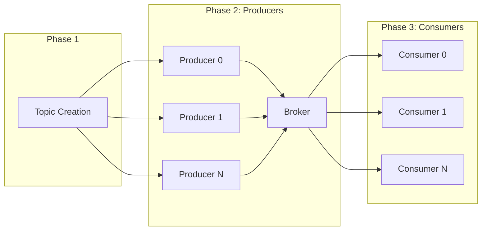

# Benchmarks

## Purpose and Scope

This document explains how to use the built-in benchmarking tool to measure cursus's throughput, latency, and system behavior under load. The benchmark tool simulates realistic workloads with configurable numbers of concurrent producers and consumers, partitions, and message counts.

For information about performance tuning configuration parameters that affect benchmark results, see [Performance Tuning](./performance.md).

## Benchmark Tool Overview

The cursus benchmarking system consists of three primary components:

### Component

The benchmark tool executes a three-phase workflow:

1. **Topic Creation Phase**: Creates the test topic with specified partitions
2. **Producer Phase**: Spawns concurrent producers to publish messages
3. **Consumer Phase**: Spawns concurrent consumers to read messages from disk

## Benchmark Architecture



### Running Benchmarks Locally

The benchmark tool is built as part of the standard build process:

```
make build
```

This compiles the benchmark binary to bin/bench. Alternatively, build only the benchmark tool:

```
go build -o bin/bench cmd/bench/main.go
```

## Starting the Broker

Before running benchmarks, ensure the broker server is running:

### Start broker in foreground

```
./bin/cursus
```

### Or start in background

```
./bin/cursus &
```

Wait for the broker to become ready (health check on port 9080):

```
curl http://localhost:9080/health
```

### Running a Basic Benchmark

Execute the benchmark with default parameters:

```
./bin/bench
```

### Default Configuration:

```
Broker Address: localhost:9000
Topic Name: bench-topic
Partitions: 12
Producers: 12
Consumers: 12
Messages per Producer: 100
```

## Command-Line Options

The benchmark tool accepts the following flags:

| Flag        | Type    | Default        | Description                       |
|------------|---------|----------------|-----------------------------------|
| -addr      | string  | localhost:9000 | Broker TCP address and port       |
| -topic     | string  | bench-topic    | Topic name for benchmark          |
| -partitions| int     | 12             | Number of partitions to create    |
| -producers | int     | 12             | Number of concurrent producers    |
| -consumers | int     | 12             | Number of concurrent consumers    |
| -messages  | int     | 100            | Messages published per producer   |


## Example: High-Throughput Test

Test with high message volume and many producers:

```
./bin/bench -producers 50 -consumers 50 -messages 1000 -partitions 24
```

This produces 50,000 total messages (50 producers × 1000 messages each) distributed across 24 partitions.

## Example: Single Producer/Consumer

Test serial performance:

```
./bin/bench -producers 1 -consumers 1 -messages 10000 -partitions 1
```

## Example: Producer-Only Test

Benchmark publishing throughput without consumption overhead:

```
./bin/bench -producers 10 -consumers 0 -messages 5000
```

## Benchmark Execution Sequence

### Phase 1: Topic Creation

The `RunTopicCreationPhase()` method establishes a TCP connection and sends a CREATE command:

- Command Format: `CREATE <topic> <partitions>`
- Example: `CREATE bench-topic 12`

The method handles idempotent topic creation - if the topic already exists, the benchmark continues without error.

### Phase 2: Producer Phase

The `RunConcurrentProducerPhase()` spawns NumProducers goroutines, each calling `RunMessageProductionPhase()`. 

Each producer:
- Divides MessagesPerProducer across Partitions using integer division
-Spawns one goroutine per partition via `sendMessagesToPartition()`
- Each partition goroutine sends messages sequentially over a persistent TCP connection
- Waits for "OK" acknowledgment after each message
- Message Format: Each message is formatted as `bench-msg-P{producerID}-Part{partitionID}-Msg{msgIndex}`

Protocol: Messages are encoded using `util.EncodeMessage()` and sent with length prefixes via `util.WriteWithLength()`.

### Phase 3: Consumer Phase

The `RunConsumerPhase()` spawns one goroutine per partition via `consumeMessagesFromPartition()`. 

Each consumer:
- Establishes a TCP connection to the broker
- Sends a CONSUME command
- Reads messages sequentially using `util.ReadWithLength()`
- Continues until the expected message count is reached or EOF is encountered
- Timeout Configuration: Uses `AckTimeout * 2 (10 seconds)` for read operations to accommodate high-throughput scenarios.

## Understanding Benchmark Output

### Sample Output

```
Initializing Topic 'bench-topic' with 12 partitions...
Topic 'bench-topic' already exists, continuing...

Starting Producer Phase (12 Producers, 1200 Total Messages)
Producer Phase Finished in 2.345s

Starting Consumer Phase (12 Consumers)
Consumer0 finished reading 100/100 messages.
Consumer1 finished reading 100/100 messages.
...
Consumer Phase Finished in 1.234s

🧪 BENCHMARK RESULT [disk] 🧪
-------------------------------------
 Topic                 : bench-topic
 Partitions            : 12
 Producers             : 12
 Consumers             : 12
 Total Messages        : 1200
 Producer Duration     : 2.345s
 Consumer Duration     : 1.234s
 Total Duration (P+C)  : 3.579s
 Throughput (Combined) : 335.28 msg/sec
-------------------------------------

```

### Output Metrics Explained

| Metric                 | Description                               | Calculation                         |
|------------------------|-------------------------------------------|-------------------------------------|
| Producer Duration       | Time to publish all messages              | `time.Since(producerStart)`           |
| Consumer Duration       | Time to consume all messages from disk   | `time.Since(consumerStart)`           |
| Total Duration (P+C)    | Sum of producer and consumer phases      | `producerDuration + consumerDuration` |
| Throughput (Combined)   | Messages per second (end-to-end)         | `totalMessages / totalDuration.Seconds()` |
| Throughput (Produce)    | Publishing rate (producer-only mode)     | `totalMessages / producerDuration.Seconds()` |

**Important**: Throughput includes both publish and consume operations. For producer-only benchmarks (-consumers 0), only "Throughput (Produce)" is displayed.

## CI/CD Integration

### Automated Benchmark Workflow

The repository includes a GitHub Actions workflow that runs benchmarks automatically on every push to main and on pull requests.

- Workflow File: `.github/workflows/benchmark.yml`

## Health Check Polling

The CI workflow waits up to 30 seconds for the broker to become ready by polling the health endpoint:

```
for i in {1..30}; do
  if curl -f http://localhost:9080/health 2>/dev/null; then
    echo "Broker server ready."
    break
  fi
  if [ $i -eq 30 ]; then
    echo "Broker failed to start within 30 seconds"
    exit 1
  fi
  sleep 1
done
```

This ensures the broker is fully operational before benchmark execution begins.

## Running Benchmarks via Make

The Makefile provides a convenience target:

```
make bench
```

This internally invokes the benchmark binary with default parameters. To customize benchmark parameters in CI, modify the bench target in the Makefile or pass environment variables.

## Concurrency Model

### Producer Concurrency

Each producer operates independently in its own goroutine. Within each producer, partition sends are parallelized:

```
BenchmarkRunner
├── Producer Goroutine 0
│   ├── Partition 0 Goroutine
│   ├── Partition 1 Goroutine
│   └── Partition N Goroutine
├── Producer Goroutine 1
│   ├── Partition 0 Goroutine
│   ├── Partition 1 Goroutine
│   └── Partition N Goroutine
└── ...
```

Message Distribution: Messages are distributed evenly across partitions using integer division:

```
msgsPerPartition = NumMessages / Partitions
```

Remainder messages are distributed to the first remainder partitions

### Consumer Concurrency

Each partition is consumed by a dedicated goroutine. Consumers are assigned to partitions using modulo arithmetic:

```
consumerID = partitionID % NumConsumers
```

This ensures partition messages are consumed in order while distributing load across consumers.

## Timeout Configuration

The benchmark client uses a configurable timeout for all network operations:

- Constant: `AckTimeout = 5 * time.Second`
- Applied To:
  - Command acknowledgments (topic creation, publish operations)
  - Message read operations (consumer phase uses `AckTimeout * 2` = 10 seconds)

If operations exceed the timeout, the benchmark fails with a descriptive error message indicating which producer/consumer encountered the timeout.

## Error Handling

### Producer Error Aggregation

Producer errors are collected using a mutex-protected slice. If any producer fails, the benchmark reports:

| Aspect              | Behavior                                                                 |
|--------------------|--------------------------------------------------------------------------|
| Error Collection    | Producer errors stored in mutex-protected slice                           |
| Reported Metrics    | Total number of failed producers, first error encountered |
| Benchmark Behavior  | Terminates immediately if any producer phase errors occur                |

## Consumer Error Reporting

Consumer errors are printed to stdout but do not terminate the benchmark. 

Each consumer reports:
- Consumer ID
- Partition ID
- Number of messages successfully consumed vs. expected

This allows partial results even if some consumers encounter issues.

## Protocol Details

### Message Encoding

All benchmark messages use the standard cursus protocol:

- **Encode Message**: `util.EncodeMessage(topic, payload)` creates a topic-prefixed message
- **Optional Compression**: If EnableGzip is true, `server.CompressMessage()` compresses the payload
- **Length-Prefixed Send**: `util.WriteWithLength()` sends a 4-byte length prefix followed by message data

### CONSUME Command Format

The consumer phase sends commands in this format:

```
CONSUME topic=<name> partition=<N> offset=<N> group=<name> generation=<N> member=<id>
```

This instructs the broker to read messages from the specified partition starting at the given offset.

## Disk-Level Benchmarks (Go test)

In addition to the end-to-end benchmark tool, cursus includes Go-native benchmarks for measuring disk I/O performance in isolation. These are useful for evaluating the impact of storage-layer optimizations without network overhead.

### Running Disk Benchmarks

```bash
go test ./pkg/disk/ -bench=. -benchmem -count=3 -timeout=120s
```

### Available Benchmarks

| Benchmark | Description |
|-----------|-------------|
| `BenchmarkWriteBatch_100` | Write 100-message batches to disk |
| `BenchmarkWriteBatch_500` | Write 500-message batches to disk |
| `BenchmarkSerializeDiskMessage` | Serialize a single DiskMessage to binary format |
| `BenchmarkReadMessages` | Read 100 messages from a 1000-message segment |

### Running Specific Benchmarks

```bash
# Serialize only
go test ./pkg/disk/ -bench=BenchmarkSerializeDiskMessage -benchmem -count=5

# Write path only
go test ./pkg/disk/ -bench='BenchmarkWriteBatch' -benchmem -count=3

# Read path only
go test ./pkg/disk/ -bench=BenchmarkReadMessages -benchmem -count=3
```

### Interpreting Results

```
BenchmarkWriteBatch_100-14    48786    24185 ns/op    17165 B/op    105 allocs/op
```

- **48786**: iterations run
- **24185 ns/op**: nanoseconds per operation
- **17165 B/op**: bytes allocated per operation
- **105 allocs/op**: heap allocations per operation

Lower values in all three metrics indicate better performance. The `allocs/op` metric is particularly important for GC pressure under sustained load.
