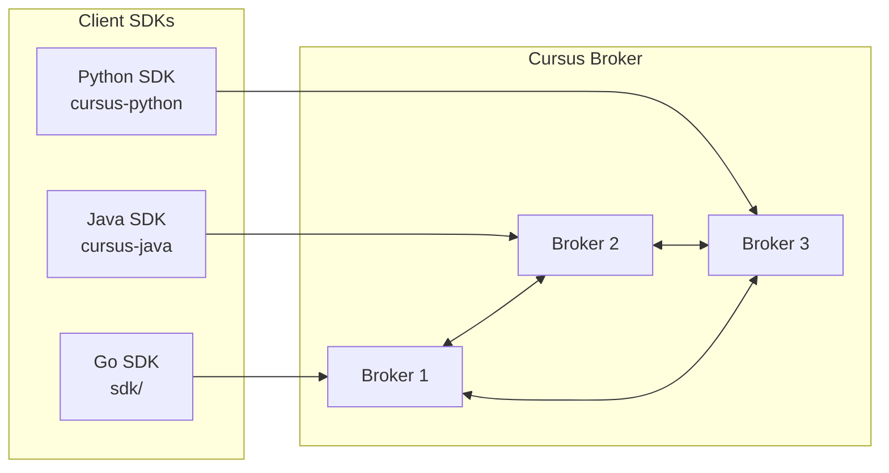
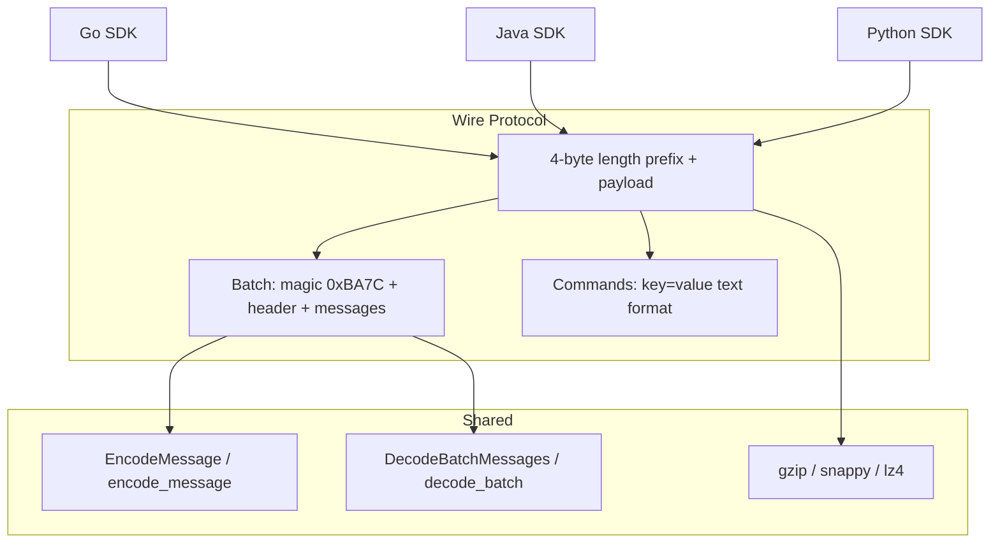
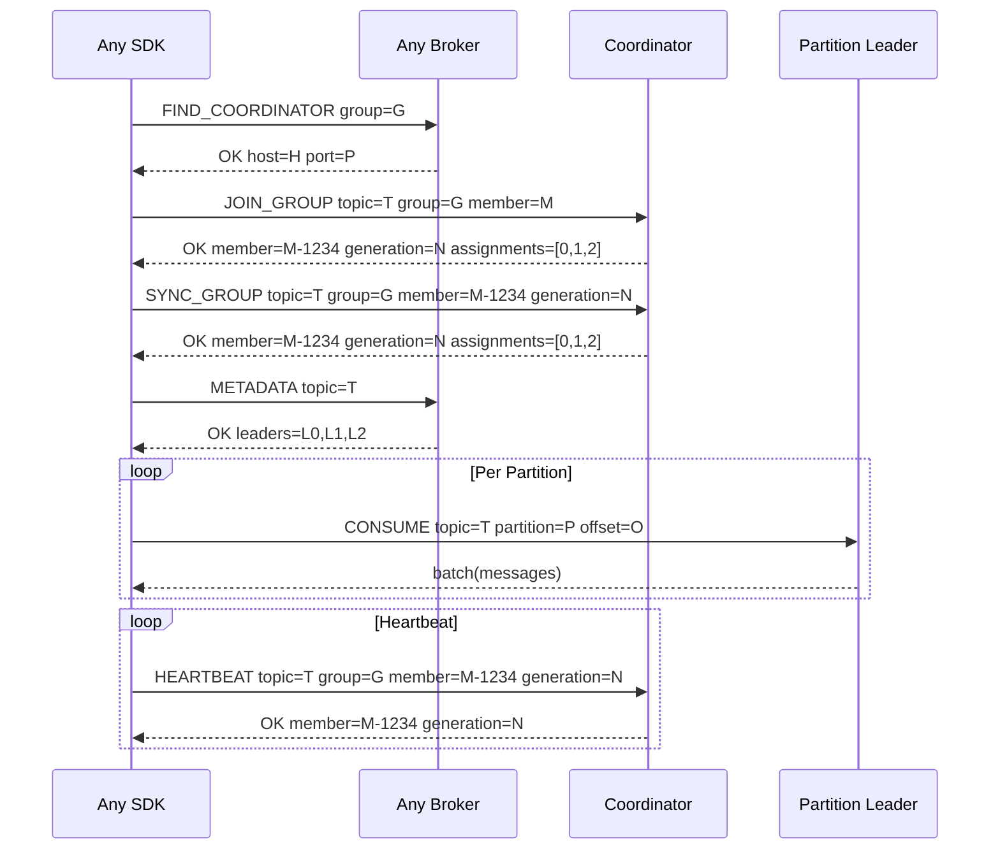

# SDK Overview

Cursus broker에 연결하는 3개 SDK의 아키텍처 개요.

## SDK Ecosystem



## Wire Protocol Compatibility

All SDKs implement the same wire protocol:



## Feature Matrix

| Feature | Go SDK | Java SDK | Python SDK |
|---|---|---|---|
| Producer (sync) | ✅ | ✅ | ✅ |
| Producer (async) | — | — | ✅ AsyncProducer |
| Consumer (polling) | ✅ | ✅ | ✅ |
| Consumer (streaming) | ✅ | ✅ | ✅ |
| Consumer Groups | ✅ | ✅ | ✅ |
| EventStore | ✅ | — | ✅ |
| Compression (gzip) | ✅ | ✅ | ✅ |
| Compression (snappy) | ✅ | — | ✅ (extras) |
| Compression (lz4) | ✅ | — | ✅ (extras) |
| TLS | ✅ | ✅ | ✅ |
| FindCoordinator | ✅ | ✅ | ✅ |
| Partition Leader Routing | ✅ | ✅ | ✅ |
| Protocol capability negotiation | ✅ | pending | pending |
| Typed structured broker errors | ✅ | pending | pending |
| Framework Integration | — | Spring Boot | FastAPI |
| Iterator Pattern | — | — | ✅ for/async for |

## Cluster Consumer Routing


## Protocol Capability Negotiation

The Go SDK can query broker capabilities with `sdk.FetchProtocolInfo(conn)` and negotiate a connection with `sdk.NegotiateProtocol(conn, request)`. High-level producer and consumer clients perform the same handshake automatically when protocol settings are configured:

```go
cfg := sdk.NewDefaultConsumerConfig()
cfg.ProtocolVersion = 1
cfg.ProtocolFeatures = []string{"structured_errors_v1", "offset_resume_v1"}
cfg.RequireProtocolFeatures = true
```

The default configuration leaves automatic negotiation disabled for compatibility with older brokers. Set `ProtocolVersion` or at least one `ProtocolFeatures` entry to enable it. Negotiation then runs once for every newly opened or reconnected TCP connection. A failed required negotiation closes the connection before it can be used, and `RequireProtocolFeatures=true` requires at least one configured feature. `ProtocolNegotiationTimeoutMS` bounds the handshake; values less than or equal to zero use 5000 ms.

Broker failures returned by negotiation are available as `*sdk.BrokerError`:

```go
var brokerErr *sdk.BrokerError
if errors.As(err, &brokerErr) {
    if brokerErr.Retryable {
        // Apply bounded backoff or redirect handling before retrying.
    }
}
```

`BrokerError` exposes `Code`, `Class`, `Retryable`, `Fields`, and the raw response. It also remains compatible with existing Go SDK sentinels such as `ErrTopicNotFound`, `ErrInvalidPartition`, and `ErrNotLeader` through `errors.Is`.
