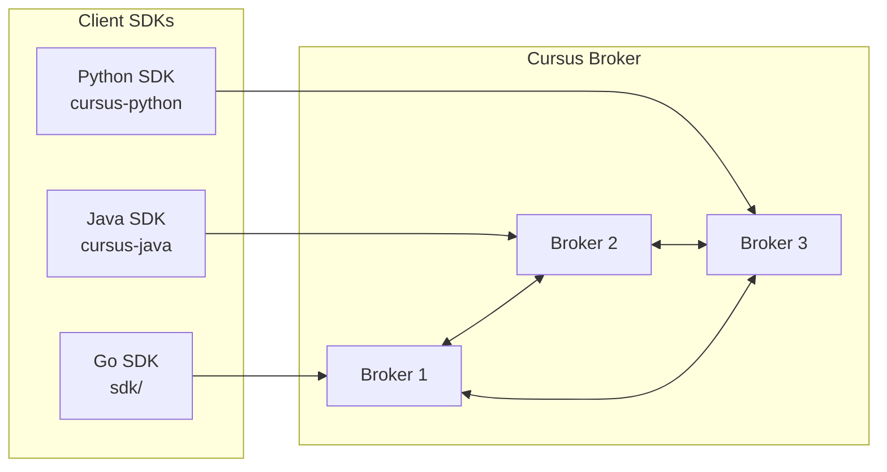
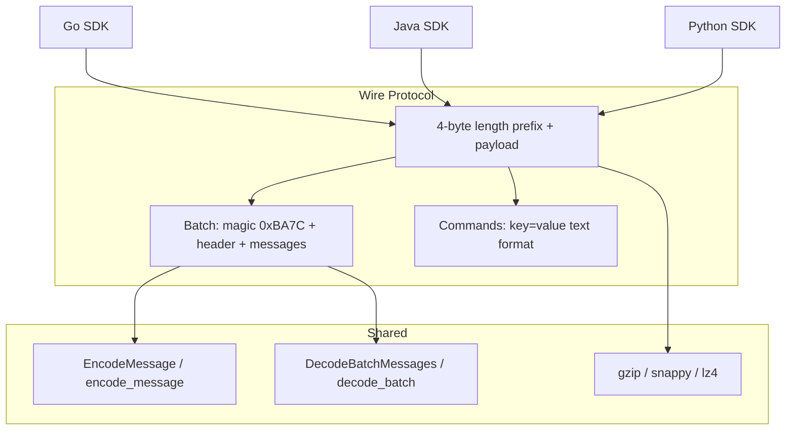
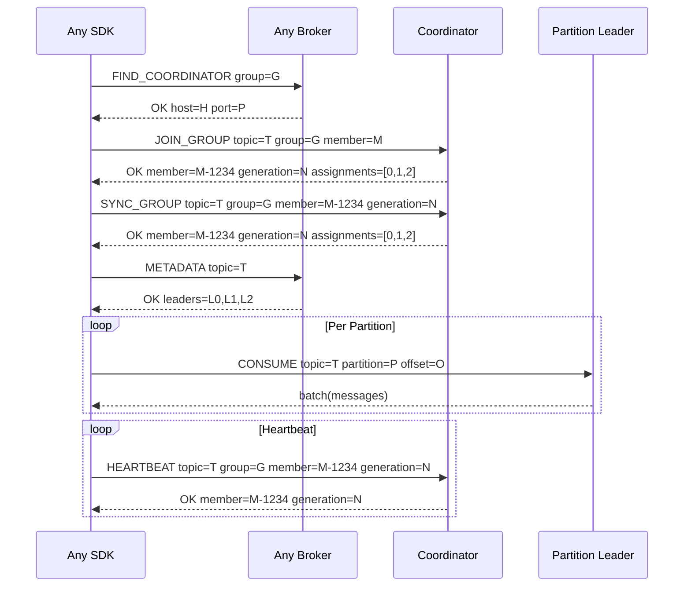

# SDK Overview

Cursus maintains one wire contract across the in-repository Go SDK and the separately released Java and Python SDKs. Broker changes are SDK-complete only after each affected client has matching contract tests and a compatible release.

## SDK Ecosystem



## Wire Protocol Compatibility

All SDKs implement the same wire protocol:



## Feature Matrix

| Feature | Go SDK | Java SDK | Python SDK |
|---|---|---|---|
| Producer (sync) | ✅ | ✅ | ✅ |
| Producer (async) | — | — | ✅ AsyncProducer |
| Consumer (polling) | ✅ | ✅ | ✅ |
| Consumer (streaming) | ✅ | ✅ | ✅ |
| Consumer Groups | ✅ | ✅ | ✅ |
| EventStore | ✅ | — | ✅ |
| Compression (gzip) | ✅ | ✅ | ✅ |
| Compression (snappy) | ✅ | — | ✅ (extras) |
| Compression (lz4) | ✅ | — | ✅ (extras) |
| TLS | ✅ | ✅ | ✅ |
| FindCoordinator | ✅ | ✅ | ✅ |
| Partition Leader Routing | ✅ | ✅ | ✅ |
| Broker-owned offset resume / `auto_offset_reset` | ✅ | ✅ merged in SDK repo | ✅ merged in SDK repo |
| Explicit `read_committed` / `read_uncommitted` | ✅ | follow-up required | follow-up required |
| Protocol capability negotiation | ✅ | verify before requiring features | verify before requiring features |
| Typed structured broker errors | ✅ | verify against SDK version | verify against SDK version |
| High-level broker transactions | ✅ | follow-up required | follow-up required |
| Connection authentication | ✅ | verify against SDK version | verify against SDK version |
| Framework Integration | — | Spring Boot | FastAPI |
| Iterator Pattern | — | — | ✅ for/async for |

## Cluster Consumer Routing


## Protocol Capability Negotiation

The Go SDK can query broker capabilities with `sdk.FetchProtocolInfo(conn)` and negotiate a connection with `sdk.NegotiateProtocol(conn, request)`. High-level producer and consumer clients perform the same handshake automatically when protocol settings are configured:

```go
cfg := sdk.NewDefaultConsumerConfig()
cfg.ProtocolVersion = 1
cfg.ProtocolFeatures = []string{"structured_errors_v1", "offset_resume_v1"}
cfg.RequireProtocolFeatures = true
```

The default configuration leaves automatic negotiation disabled for compatibility with older brokers. Set `ProtocolVersion` or at least one `ProtocolFeatures` entry to enable it. Negotiation then runs once for every newly opened or reconnected TCP connection. A failed required negotiation closes the connection before it can be used, and `RequireProtocolFeatures=true` requires at least one configured feature. `ProtocolNegotiationTimeoutMS` bounds the handshake; values less than or equal to zero use 5000 ms.

Broker failures returned by negotiation are available as `*sdk.BrokerError`:

```go
var brokerErr *sdk.BrokerError
if errors.As(err, &brokerErr) {
    if brokerErr.Retryable {
        // Apply bounded backoff or redirect handling before retrying.
    }
}
```

`BrokerError` exposes `Code`, `Class`, `Retryable`, `Fields`, and the raw response. It also remains compatible with existing Go SDK sentinels such as `ErrTopicNotFound`, `ErrInvalidPartition`, and `ErrNotLeader` through `errors.Is`.

## Go Topic Policy

`CreateTopic` remains the compatibility API and inherits broker policy defaults. Use `CreateTopicWithOptions` for an explicit cleanup contract:

```go
err := producer.CreateTopicWithOptions("player-state", sdk.TopicOptions{
    Partitions:     12,
    CleanupPolicy:  sdk.TopicCleanupCompact,
    RetentionHours: 168,
    Partitioner:    "hash_key",
})
```

The SDK canonicalizes `compact,delete` to `delete,compact` and validates the portable topic-name contract and rejects unsafe command values, negative retention, or unknown policy enums before opening a broker connection. Compact policies require a standalone, non-event-sourcing topic. `EventStore.CreateTopic` explicitly declares `cleanup_policy=delete`.

## Go Transactional Producer

The Go SDK exposes both the existing low-level transaction commands and a
session-preserving `TransactionalProducer`:

```go
cfg := sdk.NewDefaultConsumerConfig()
cfg.BrokerAddrs = []string{"broker-1:9000", "broker-2:9000"}

client, err := sdk.NewConsumerClient(cfg)
if err != nil {
    return err
}
producer, err := client.NewTransactionalProducer("game-server-events")
if err != nil {
    return err
}
if err := producer.Begin(); err != nil {
    return err
}
if err := producer.Publish("events", -1, sdk.Message{
    SeqNum:  1,
    Key:     "match-42",
    Payload: payload,
}); err != nil {
    _ = producer.Abort()
    return err
}
if err := producer.SendOffsets(
    "events",
    groupID,
    memberID,
    generation,
    map[int]uint64{partition: lastProcessedOffset + 1},
); err != nil {
    _ = producer.Abort()
    return err
}
return producer.Commit()
```

The broker allocates and fences the producer ID and epoch. The high-level
producer retains that session across reconnects and serializes lifecycle calls.
A successful `Commit` or `Abort` consumes the current epoch; the next `Begin`
automatically reinitializes the session and obtains a higher epoch. Retrying an
uncertain finalization continues to use the same epoch, preserving idempotency. Once the broker reports `state=committing`, retry `Commit`; do not switch that epoch to abort.

`NOT_COORDINATOR` responses update a per-transaction coordinator cache and are
retried with a bounded delay. Fencing, authorization, validation, and ambiguous
network failures are returned to the caller as errors rather than retried. The
broker is authoritative for final transaction state; `Describe` returns the
typed state, message count, and offset count.

One transaction may publish to multiple output partitions, but staged consumer
offsets must share one `(topic, group, member, generation)` scope. Duplicate
partition entries merge monotonically and the scope commits through one fenced
bulk offset update. Use separate transactions for separate consumer scopes.

Commit writes idempotent output records, appends partition transaction markers,
applies the bulk source offset update, then persists the final coordinator
decision. `read_committed` requires both marker and decision, so output stays
hidden during a recoverable crash window before finalization.

## Go Consumer Resume Contract

The Go consumer fetches the broker-owned committed `nextOffset` after
assignment and rejoin. Applications that commit after processing should commit
`lastProcessedOffset + 1`. Reconnects roll back the local fetch position to the
last broker-committed offset, providing at-least-once processing.

`AutoOffsetResetEarliest` and `AutoOffsetResetLatest` are sent as
`autoOffsetReset=earliest|latest` in polling and streaming commands.
`AutoOffsetResetError` leaves reset selection disabled and surfaces an
out-of-range condition.

`ConsumerConfig.ReadIsolation` selects `sdk.ReadCommitted` or
`sdk.ReadUncommitted`; the default is `ReadCommitted`. The SDK sends the value
explicitly on both `CONSUME` and `STREAM`. Committed reads expose
non-transactional records and transaction records only after both the matching
partition marker and final coordinator decision are durable. They skip aborted
transactions and stop at the earliest unresolved transaction. Uncommitted reads
return the raw committed partition log, including transaction control records.

## Go Client Authentication

Publisher and consumer configs accept connection credentials:

```go
cfg.Principal = "game-server"
cfg.AuthToken = os.Getenv("CURSUS_AUTH_TOKEN")
```

When both fields are set, every new or reconnected SDK connection performs
`AUTH principal=<principal> token=<token>` after protocol negotiation and
before application commands. The two fields must be configured together.
Authentication and authorization failures are returned as typed
`*sdk.BrokerError` values. TLS remains required when credentials cross an
untrusted network.