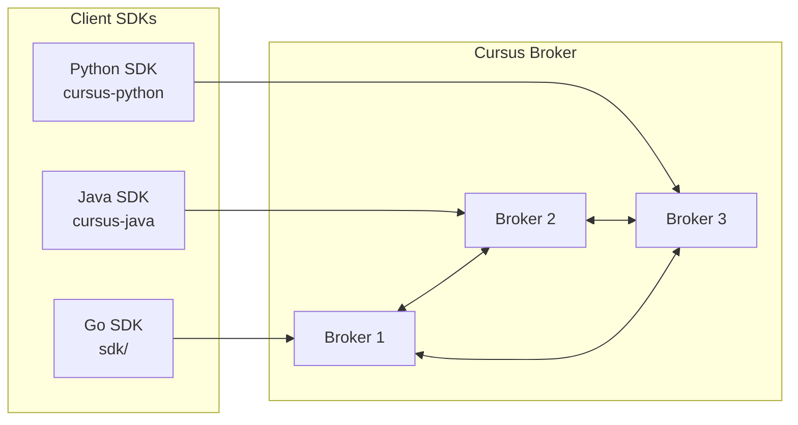
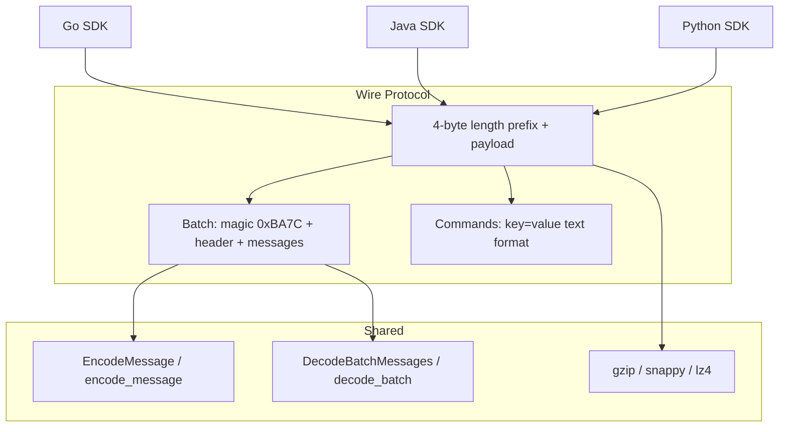
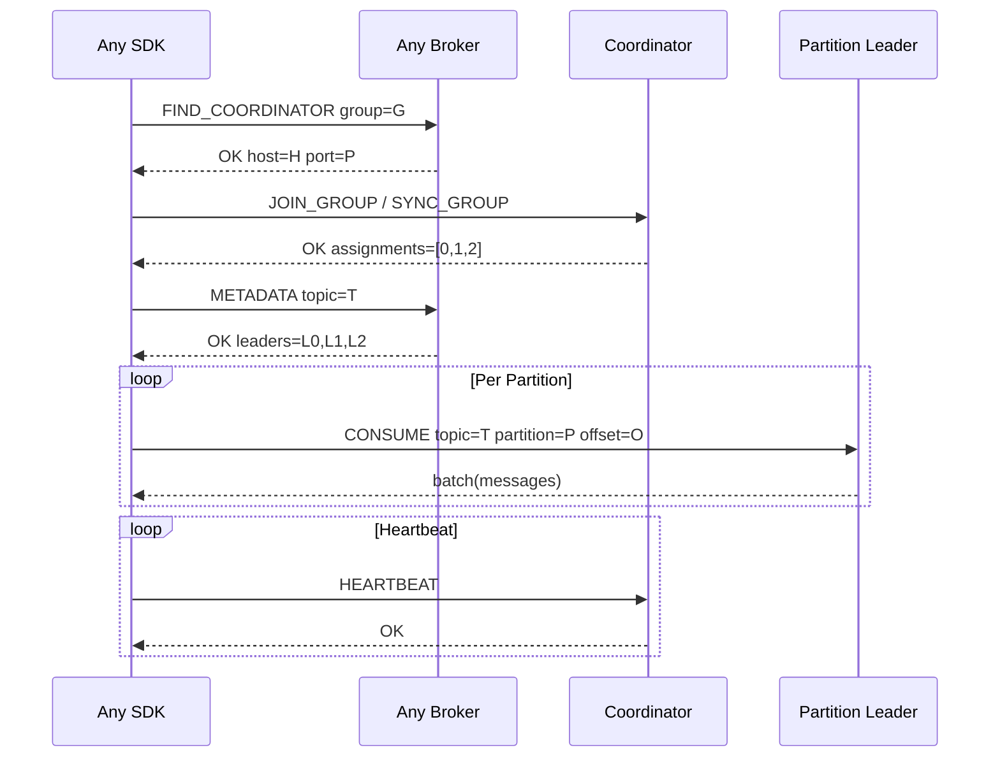

# SDK Overview

Cursus broker에 연결하는 3개 SDK의 아키텍처 개요.

## SDK Ecosystem

## Wire Protocol Compatibility

All SDKs implement the same wire protocol:

## Feature Matrix

| Feature | Go SDK | Java SDK | Python SDK |
|---|---|---|---|
| Producer (sync) | ✅ | ✅ | ✅ |
| Producer (async) | — | — | ✅ AsyncProducer |
| Consumer (polling) | ✅ | ✅ | ✅ |
| Consumer (streaming) | ✅ | ✅ | ✅ |
| Consumer Groups | ✅ | ✅ | ✅ |
| EventStore | ✅ | — | ✅ |
| Compression (gzip) | ✅ | ✅ | ✅ |
| Compression (snappy) | ✅ | — | ✅ (extras) |
| Compression (lz4) | ✅ | — | ✅ (extras) |
| TLS | ✅ | ✅ | ✅ |
| FindCoordinator | ✅ | ✅ | ✅ |
| Partition Leader Routing | ✅ | ✅ | ✅ |
| Framework Integration | — | Spring Boot | FastAPI |
| Iterator Pattern | — | — | ✅ for/async for |

## Cluster Consumer Routing

