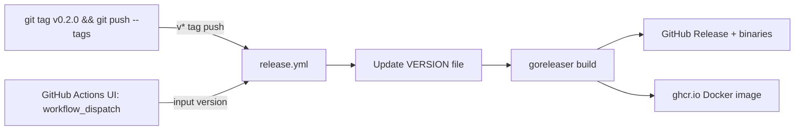
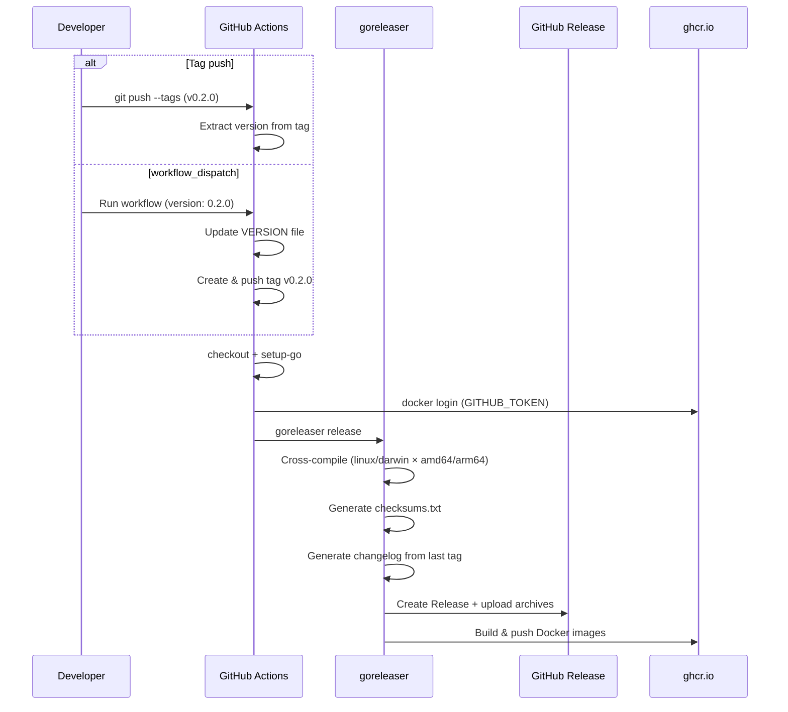

# Release Automation CI Design

**Date**: 2026-04-26

## Overview

수동 트리거 또는 태그 push 시 GitHub Release + 크로스 컴파일 바이너리 + Docker 이미지를 배포하는 단일 워크플로우 설계.



## 릴리즈 방법 (2가지)

| 방법 | 사용 시점 | 동작 |
|------|----------|------|
| `git tag v0.2.0 && git push --tags` | 로컬에서 태그 직접 생성 | 태그 기반으로 즉시 릴리즈 |
| GitHub Actions UI → Run workflow | 브라우저에서 버전 입력 | VERSION 업데이트 + 태그 생성 + 릴리즈 |

## Workflow: `release.yml`

### Trigger

```yaml
on:
  push:
    tags: ['v*']
  workflow_dispatch:
    inputs:
      version:
        description: 'Release version (e.g. 0.2.0)'
        required: true
```

### Flow



### Steps

1. `actions/checkout@v4` (fetch-depth: 0, changelog 생성에 필요)
2. `actions/setup-go@v5` (go 1.26.2)
3. (workflow_dispatch 시) VERSION 파일 업데이트 + 태그 생성 & push
4. `docker/login-action` (ghcr.io, GITHUB_TOKEN)
5. `goreleaser/goreleaser-action@v6` (release)

### Build Matrix

goreleaser가 내부적으로 처리:

| OS | Arch | Binaries |
|----|------|----------|
| linux | amd64, arm64 | cursus, cursus-cli |
| darwin | amd64, arm64 | cursus, cursus-cli |

### Release Artifacts

```
cursus_0.2.0_linux_amd64.tar.gz
cursus_0.2.0_linux_arm64.tar.gz
cursus_0.2.0_darwin_amd64.tar.gz
cursus_0.2.0_darwin_arm64.tar.gz
checksums.txt
```

### Docker Images

```
ghcr.io/cursus-io/cursus:0.2.0
ghcr.io/cursus-io/cursus:latest
```

## `.goreleaser.yml`

```yaml
project_name: cursus

builds:
  - id: cursus
    main: ./cmd/broker
    binary: cursus
    goos: [linux, darwin]
    goarch: [amd64, arm64]
    env: ['CGO_ENABLED=0']
    ldflags: ['-s', '-w', '-X main.version={{.Version}}']

  - id: cursus-cli
    main: ./cmd/cli
    binary: cursus-cli
    goos: [linux, darwin]
    goarch: [amd64, arm64]
    env: ['CGO_ENABLED=0']
    ldflags: ['-s', '-w', '-X main.version={{.Version}}']

archives:
  - format: tar.gz
    name_template: '{{ .ProjectName }}_{{ .Version }}_{{ .Os }}_{{ .Arch }}'

checksum:
  name_template: 'checksums.txt'

changelog:
  sort: asc
  filters:
    exclude: ['^\[skip ci\]']

dockers:
  - image_templates:
      - 'ghcr.io/cursus-io/cursus:{{ .Version }}'
      - 'ghcr.io/cursus-io/cursus:latest'
    dockerfile: Dockerfile
    build_flag_templates:
      - '--label=org.opencontainers.image.source=https://github.com/cursus-io/cursus'
      - '--label=org.opencontainers.image.version={{ .Version }}'
```

## Required Secrets

| Secret | Source | Purpose |
|--------|--------|---------|
| `GITHUB_TOKEN` | Auto-provided | Release creation, ghcr.io push |

별도 secret 추가 불필요. `permissions: contents: write, packages: write` 설정 필요.

## Implementation Files

| File | Purpose |
|------|---------|
| `.github/workflows/release.yml` | Tag push / workflow_dispatch → goreleaser → GitHub Release + Docker |
| `.goreleaser.yml` | Build matrix, archives, Docker, changelog |
| `VERSION` | Current version (already exists: 0.1.0) |

## Considerations

- **Dockerfile**: 현재 Go 1.25.0 기반이지만, goreleaser는 자체 빌드 후 Dockerfile의 COPY 단계만 사용하므로 호환 문제 없음
- **VERSION 파일**: workflow_dispatch 시에만 업데이트. 태그 push 방식에서는 goreleaser가 태그에서 버전 추출
- **changelog**: goreleaser가 이전 태그 ~ 현재 태그 사이 커밋으로 자동 생성
